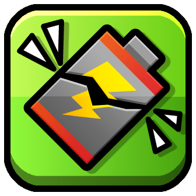
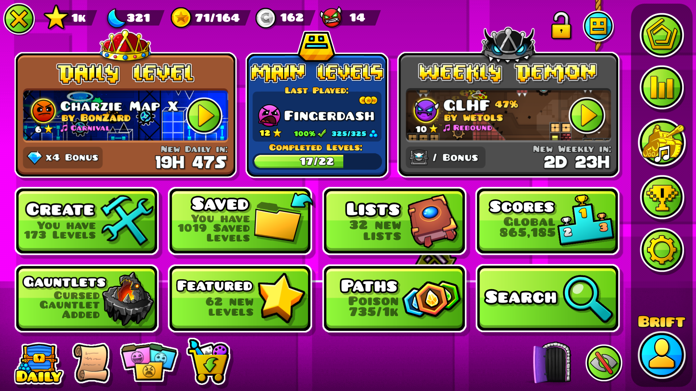

# Overcharged Main Menu

This is where she makes a mod.

Geometry Dash if it was a flashy mobile game.

## A recreation of Brift's [main menu concept](https://x.com/BriftXD/status/1793841225298285024):

## Preview:

# Special thanks to:
- [Brift](https://twitter.com/BriftXD), for making the original concept, as well as providing me the textures.
- [ninXout](https://github.com/ninXout), for writing the baseline of the mod so I could have an easier time continuing the work.
- [The GD Modding server](https://discord.gg/gd-modding-822510988409831486), for providing feedbacks and bug reports when the mod was in development.
- [GD-Roulette](https://github.com/SpaghettDev/GD-Roulette), [GDDP Integration](https://github.com/Minemaker0430/GDDPIntegration) and [Super Expert](https://github.com/LXanii/Super-Expert) for the sprites that we forcefully stole for compatibilities :D.
- [Level Thumbnails](https://github.com/cdc-sys/level-thumbs-mod), because I pretty much copied its code and used its thumbnail hosting github for the thumbnails of the timely levels.
- [zmx](https://github.com/qimiko), [Erymanthus](https://github.com/RayDeeUx) and [catgirlanh](https://github.com/AnhNguyenlost13), for testing this mod on MacOS